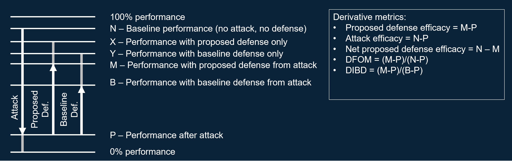

# Scenarios
Armory is intended to evaluate threat-model scenarios. Baseline evaluation scenarios 
are described below. Additionally, we've provided some academic standard scenarios.

## Base Scenario Class
All scenarios inherit from the [Base Armory Scenario](../armory/scenarios/base.py). The 
base class parses an armory configuration file and calls a particular scenario's 
private `_evaluate` to perform all of the computation for a given threat-models 
robustness to attack. All `_evaluate` methods return a  dictionary of recorded metrics 
which are saved into the armory `output_dir` upon  completion.
 
## Baseline Scenarios
Currently the following Scenarios are available within the armory package.

### RESISC image classification

* **Description:**
In this scenario, the application is overhead imagery scene classification.
* **Dataset:**
The dataset is the NWPU RESISC-45 dataset (http://www.escience.cn/people/JunweiHan/NWPU-RESISC45.html).
It comprises 45 classes and 700 images for each class.  Images 1-500 of each class are in the training split,
500-600 are in the validation split, and 600-700 are in the test split.    
* **Baseline Model:**
To maximize time spent on defense research, a baseline model will be provided, but
performers are not required to use it, if their defense requires different architecture.
The model is an Imagenet-pretrained DenseNet-121 that is fine-tuned on RESISC-45.
* **Threat Scenario:**
  * Adversary objectives:
    * Untargeted - an adversary may simply wish to evade detection
    * Targeted - an adversary may wish to divert attention or resources to scenes that are otherwise uninteresting
  * Adversary Operating Environment:
    * Non-real time, digital evasion attack - attack is not "per-example" bur rather "universal." The goal is to 
    mimic conditions under which physical evasion attack could be carried out.
    * Black-box, white-box, and adaptive attack will be performed on defenses
  * Adversary Capabilities and Resources
    * Attacks that are non-overtly perceptible under quick glance are allowed - we assume in this scenario that 
    a human may at most passively monitor the classification system. Use own judgement on the maximum perturbation 
    budget allowed while remaining "non-overtly perceptible under quick glance."
    * Type of attacks that will be implemented during evaluation: universal perturbation (untargeted attack) and 
    universal patch (targeted attack, assuming no larger than 25% of the total area)
* **Metrics of Interest:**
  * Primary metrics:
    * Mean accuracy, attack computational cost, defense computational cost, various distance measures of perturbation 
    (Lp-norms, Wasserstein distance)
  * Derivative metrics - see end of document 
* **Baseline Model Performance:**
* **Baseline Defense Performance:**

### Librispeech speaker audio classification

* **Description:** 
* **Threat Scenario:**
* **Metrics of Interest:**
* **Baseline Model Performance:**
* **Baseline Defense Performance:**:

### UCF101 video classification

* **Description:** 
* **Threat Scenario:**
* **Metrics of Interest:**
* **Baseline Model Performance:**
* **Baseline Defense Performance:**

### German traffic sign poisoned image classification

* **Description:** 
* **Threat Scenario:**
* **Metrics of Interest:**
* **Baseline Model Performance:**
* **Baseline Defense Performance:**

## Academic Scenarios

### Cifar10 image classification

* **Description:** This is a standard white-box attack scneario. 
* **Threat Scenario:** White-box attack
* **Metrics of Interest:** Benign accuracy, Adversarial accuracy, Adversarial purturbation
* **Baseline Model Performance:** 
* **Baseline Defense Performance:** See academic literature for the most up to date results

### MNIST image classification

* **Description:**
* **Threat Scenario:** White-box attack 
* **Metrics of Interest:** Benign accuracy, Adversarial accuracy, Adversarial purturbation
* **Baseline Model Performance:** 
* **Baseline Defense Performance:** See academic literature for the most up to date results

## Creating a new scenario
Users may want to create their own scenario, because the baseline scenarios do 
not fit the requirements of some defense/threat-model, or because it may be easier 
to debug in code that you have access to as opposed to what is pre-installed by the 
armory package.

An [example of doing this](https://github.com/twosixlabs/armory-example/blob/master/example_scenarios/audio_spectrogram_classification.py) can be found in our armory-examples repo:

## Derivative metrics

