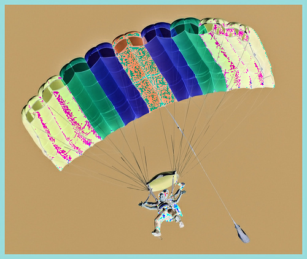
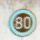
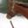
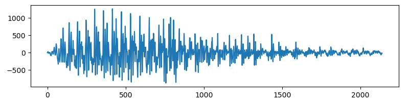
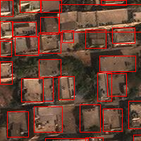
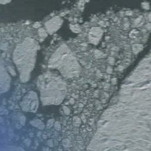

# TFDSv4 Dataset Migration Documentation

This file will act as a placeholder for any documentation related to the changes being made during the migration to [tfdsv4](https://github.com/twosixlabs/armory/milestone/18) with the hope that the discrepency between input/output shapes across all dataloaders & scenarios is clearer.

## High Level Changes

 Introduction of a `Task` which represents a group of datasets & their related scenarios. For example, the `Video` task would represent `carla_video_tracking` along with `carla_mot` and their respective dataloaders with the expectation both data loaders will produce output of the same shape.

 More to come...

## Script
The script below is intended to get information about the `tfds` format of a dataset prior to any calling any preprocessing functions defined in Armory to pass to a task/scenario. This script should work as long as the dataset has been built with `tfds` and uploaded to S3.
```python
from armory.datasets.load import load
import tensorflow_datasets as tfds

def get_ds_iterator(ds_dict, split):
    ds = ds_dict[split]
    iterator = iter(ds)
    return iterator

name = "imagenette"
config = None

info, ds_dict = load(name = name, config = config)
print(ds_dict.keys()) # dict_keys(['train', 'validation'])

iterator = get_ds_iterator(ds_dict, "validation")
x = iterator.__next__()
print(type(x), x.keys()) # dict, dict_keys(['image', 'label'])

print(x["image"].shape) # [422, 500, 3]

print(tfds.as_numpy({k:v for k,v in x.items() if k != "image"})) # {'label': 9}
```

## `imagenette`
- config: 
- split keys: `["train", "validation"]`
### Example


### TFDS Format: No Preprocessing
```
{'label': 9}
```
- excluding `image` key
- example `shape`: `[422, 500, 3]`
- example `(min`, `max)`: `(0, 255)`

## `ucf101`
- config:
- split keys: `["train", "test"]`

### Example


### TFDS Format: No Preprocessing
```
{'label': 12}
```
- excluding `video` key
- example `shape`: `[118, 240, 320, 3]`
- example `(min`, `max)`: `(0, 255)`

## `german_traffic_sign`
- config: `None`
- split keys: `["train", "test"]`

### Example


### TFDS Format: No Preprocessing
```
{'filename': b'01952.bmp', 'label': 5}
```
- excluding `image` key
- example `shape`: `[40, 40, 3]`
- example `(min`, `max)`: `(2, 247)`

## `so2sat`
- config: `None`
- split keys: `["train", "validation"]`

### Example


### TFDS Format: No Preprocessing
```
{'label': 7, 'sample_id': 2308}
```
- excluding `image` key
- example `shape`: `[32, 32, 3]`
- example `(min`, `max)`: `(83, 255)`

## `carla_obj_det_dev`
- config: `None`
- split keys: `["dev"]`

## `carla_obj_det_train`
- config: `None`
- split keys: `["train", "val"]`

## `carla_obj_det_test`
- config: `None`
- split keys: `["test"]`

## `carla_over_obj_det_dev`
- config: `None`
- split keys: `["dev"]`

## `carla_over_obj_det_train`
- config: `None`
- split keys: `["train", "val"]`

## `apricot_dev`
- config: `None`
- split keys: `["retinanet", "frcnn", "ssd"]`

## `apricot_test`
- config: `None`
- split keys: `["retinanet", "frcnn", "ssd"]`

## `dapricot_dev`
Resolving with `load` errors

## `dapricot_test`
Resolving with `load` errors

## `cifar10`
- config: `None`
- split keys: `["train", "test"]`

### Example


### TFDS Format: No Preprocessing
```
{'id': b'test_09933', 'label': 7}
```
- excluding `image` key
- example `shape`: `[32, 32, 3]`
- example `(min`, `max)`: `(5, 255)`

## `cifar100`
- config: `None`
- split keys: `["train", "test"]`

### Example


### TFDS Format: No Preprocessing
```
{'coarse_label': 8, 'id': b'test_09933', 'label': 43}
```
- excluding `image` key
- example `shape`: `[32, 32, 3]`
- example `(min`, `max)`: `(9, 234)`

## `digit`
- config: `None`
- split keys: `["train", "test"]`

### Example


### TFDS Format: No Preprocessing
```
{'filename': b'5_theo_2.wav', 'label': 5, 'user': b'theo'}
```
- excluding `audio` key
- example `shape`: `[2139]`
- example `(min`, `max)`: `(-874, 1262)`

## `xview`
- config: `None`
- split keys: `["train", "test"]`

### Example


### TFDS Format: No Preprocessing
```
{'objects': {'area': array([  99,  271,  124,  475, 4523, 1440,  623,  753,  775,  701,  252,
         1080,  837, 1130,  864,  414,  493,  858,  243,  898,  352, 1023,
         1121,  758,  450,  703,  492,  679,  544,  800]),
  'boxes': array([[0.955, 0.945, 1.   , 1.   ],
         [0.215, 0.44 , 0.3  , 0.52 ],
         [0.975, 0.605, 1.   , 0.73 ],
         ...
         [0.435, 0.   , 0.595, 0.085],
         [0.515, 0.69 , 0.715, 0.79 ]], dtype=float32),
  'id': array([439394, 439395, 439396, 439397, 439398, 439399, 439400, 439401,
         439402, 439403, 439404, 439405, 439406, 439407, 439408, 439409,
         439410, 439411, 439412, 439413, 439414, 439415, 439416, 439417,
         439418, 439419, 439420, 439421, 439422, 439423]),
  'image_id': array([16932, 16932, 16932, 16932, 16932, 16932, 16932, 16932, 16932,
         16932, 16932, 16932, 16932, 16932, 16932, 16932, 16932, 16932,
         16932, 16932, 16932, 16932, 16932, 16932, 16932, 16932, 16932,
         16932, 16932, 16932]),
  'is_crowd': array([False, False, False, False, False, False, False, False, False,
         False, False, False, False, False, False, False, False, False,
         False, False, False, False, False, False, False, False, False,
         False, False, False]),
  'labels': array([49, 49, 49, 49, 49, 49, 49, 49, 49, 49, 49, 49, 49, 49, 49, 49, 49,
         49, 49, 49, 49, 49, 49, 49, 49, 49, 49, 49, 49, 49])}}
```
- excluding `image` key
- value for `boxes` key is truncated
- example `shape`: `[200, 200, 3]`
- example `(min`, `max)`: `(0, 255)`

## `resisc45`
- config: `None`
- split keys: `["train", "validation", "test"]`

### Example


### TFDS Format: No Preprocessing
```
{'filename': b'sea_ice_639.jpg', 'label': 35}
```
- excluding `image` key
- example `shape`: `[256, 256, 3]`
- example `(min`, `max)`: `(51, 217)`

## `mnist`
- config: `None`
- split keys: `["test", "train"]`

### Example


### TFDS Format: No Preprocessing
```
{'label': 2}
```
- excluding `image` key
- example `shape`: `[28, 28, 1]`
- example `(min`, `max)`: `(0, 255)`

## `coco`
- config: `["2014", "2017", "2017_panoptic"]`
- split keys: `["train", "test", "validation"]`
- `"test"` does not contain `"label"`

### Example

- boxes were drawn

### Original Format
```
[{'area': 49565.45300000001,
  'iscrowd': 0,
  'image_id': 133418,
  'bbox': [303.54, 36.62, 193.68, 382.83],
  'category_id': 1,
  'id': 444415},
 {'area': 13487.548600000002,
  'iscrowd': 0,
  'image_id': 133418,
  'bbox': [386.64, 267.68, 253.36, 159.32],
  'category_id': 43,
  'id': 657440}]
```
- excluding `segmentation` key
- `bbox` format: `[xmin, ymin, width, height]`

### TFDS Format: No Preprocessing
```
{'image/filename': b'000000133418.jpg',
 'image/id': 133418,
 'objects': {'area': array([49565, 13487]),
  'bbox': array([[0.08576112, 0.47428125, 0.9823185 , 0.77690625],
         [0.62688524, 0.604125  , 1.        , 1.        ]], dtype=float32),
  'id': array([444415, 657440]),
  'is_crowd': array([False, False]),
  'label': array([ 0, 38])}}
```
- excluding `image` key
- example `shape`: `[427, 640, 3]`
- example `(min`, `max)`: `(0, 255)`
- `bbox` format: `[ymin, xmin, ymax, xmax]` normalized

### Armory Expected Input Format

#### Model

#### Attack

### Armory Output Format

## Video
