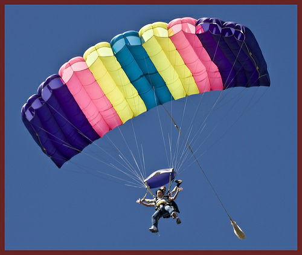
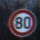

# TFDSv4 Dataset Migration Documentation

This file will act as a placeholder for any documentation related to the changes being made during the migration to [tfdsv4](https://github.com/twosixlabs/armory/milestone/18) with the hope that the discrepency between input/output shapes across all dataloaders & scenarios is clearer.

## High Level Changes

 Introduction of a `Task` which represents a group of datasets & their related scenarios. For example, the `Video` task would represent `carla_video_tracking` along with `carla_mot` and their respective dataloaders with the expectation both data loaders will produce output of the same shape.

 More to come...

## Script
The script below is intended to get information about the `tfds` format of a dataset prior to any calling any preprocessing functions defined in Armory to pass to a task/scenario. This script should work as long as the dataset has been built with `tfds` and uploaded to S3.
```python
from armory.datasets.load import load
import tensorflow_datasets as tfds

def get_ds_iterator(ds_dict, split):
    ds = ds_dict[split]
    iterator = iter(ds)
    return iterator

name = "imagenette"
config = None

info, ds_dict = load(name = name, config = config)
print(ds_dict.keys()) # dict_keys(['train', 'validation'])

iterator = get_ds_iterator(ds_dict, "validation")
x = iterator.__next__()
print(type(x), x.keys()) # dict, dict_keys(['image', 'label'])

print(x["image"].shape) # [422, 500, 3]

print(tfds.as_numpy({k:v for k,v in x.items() if k != "image"})) # {'label': 9}
```

## `imagenette`
- config: 
- split keys: `["train", "validation"]`
### Example
<!--  -->


### TFDS Format: No Preprocessing
```
{'label': 9}
```
- excluding `image` key
- example `shape`: `[422, 500, 3]`
- example `(min`, `max)`: `(0, 255)`

## `ucf101`
- config:
- split keys: `["train", "test"]`

### Example
<!--  -->


- first frame

### TFDS Format: No Preprocessing
```
{'label': 12}
```
- excluding `video` key
- example `shape`: `[118, 240, 320, 3]`
- example `(min`, `max)`: `(0, 255)`

## `german_traffic_sign`
- config: `None`
- split keys: `["train", "test"]`

### Example
<!--  -->


### TFDS Format: No Preprocessing
```
{'filename': b'01952.bmp', 'label': 5}
```
- excluding `image` key
- example `shape`: `[40, 40, 3]`
- example `(min`, `max)`: `(2, 247)`

## `so2sat`
- config: `None`
- split keys: `["train", "validation"]`

### Example
<!--  -->


### TFDS Format: No Preprocessing
```
{'label': 7, 'sample_id': 2308}
```
- excluding `image` key
- example `shape`: `[32, 32, 3]`
- example `(min`, `max)`: `(83, 255)`

## `carla_obj_det_dev`
- config: `None`
- split keys: `["dev"]`

### Example
<!--  -->


- RGB, depth, and `mask`
- boxes were drawn

### TFDS Format: No Preprocessing
```
{'categories': {'id': array([1, 2, 3, 4]),
  'name': array([b'Pedestrian', b'Vehicle', b'TrafficLight', b'Patch'], dtype=object),
  'supercategory': array([b'Pedestrian', b'Vehicle', b'TrafficLight', b'Patch'], dtype=object)},
 'images': {'file_name': array([b'_out/sensor.camera.rgb.1/config_obj_det_security_camera_perspective_1_00000612.png', b'_out/sensor.camera.depth.2/config_obj_det_security_camera_perspective_1_00000612.png'], dtype=object),
  'height': array([960, 960]),
  'id': array([84190894, 84190894]),
  'width': array([1280, 1280])},
 'objects': {'area': array([  936,   385,   433,   602,   313,  1930,   558,  1074, 54479, 11805]),
  'boxes': array([[0.48333332, 0.7164062 , 0.54895836, 0.74609375],
         [0.4875    , 0.71171874, 0.5385417 , 0.734375  ],
         [0.48645833, 0.60234374, 0.5395833 , 0.615625  ],
         [0.48541668, 0.640625  , 0.54270834, 0.66328126],
         [0.484375  , 0.62109375, 0.5385417 , 0.6328125 ],
         [0.48333332, 0.93671876, 0.575     , 0.9664062 ],
         [0.484375  , 0.6148437 , 0.54375   , 0.6304687 ],
         [0.47916666, 0.8101562 , 0.5552083 , 0.83515626],
         [0.44479167, 0.        , 0.66770834, 0.28828126],
         [0.49791667, 0.2703125 , 0.60625   , 0.40859374]], dtype=float32),
  'id': array([ 97,  98,  99, 100, 101, 102, 103, 105, 106, 109]),
  'image_id': array([84190894, 84190894, 84190894, 84190894, 84190894, 84190894, 84190894, 84190894, 84190894, 84190894]),
  'is_crowd': array([False,  True, False, False,  True, False, False, False, False, False]),
  'labels': array([1, 1, 1, 1, 1, 1, 1, 1, 2, 2])},
 'patch_metadata': {'avg_patch_depth': 0.47842735052108765,
  'gs_coords': array([[792, 445],
         [890, 442],
         [890, 507],
         [792, 493]], dtype=int32)}
}
```
- excluding `image` key
- excluding `mask` key from `patch_metadata`
- example `shape`:
  - `image`: `[2, 960, 1280, 3]`
  - `mask`: `[960, 1280, 3]`
- example `(min`, `max)`:
  - `image`: `(0, 255)`
  - `mask`: `(0, 255)`
- `boxes` format in `objects`: `[ymin, xmin, ymax, xmax]` normalized

## `carla_obj_det_train`
- config: `None`
- split keys: `["train", "val"]`

### Example
<!--  -->


- RGB, depth
- boxes were drawn

### TFDS Format: No Preprocessing
```
{'categories': {'id': array([1, 2, 3]),
  'name': array([b'Pedestrian', b'Vehicle', b'TrafficLight'], dtype=object),
  'supercategory': array([b'Pedestrian', b'Vehicle', b'TrafficLight'], dtype=object)},
 'images': {'file_name': array([b'config4.00002910.png', b'config4.00002910.png'], dtype=object),
  'height': array([960, 960]),
  'id': array([3478, 3478]),
  'width': array([1280, 1280])},
 'objects': {'area': array([ 3474,   694,   114,   206,   122, 11360,   127,   219]),
  'boxes': array([[0.49791667, 0.15390626, 0.5385417 , 0.26875   ],
         [0.50208336, 0.621875  , 0.52916664, 0.6484375 ],
         [0.49583334, 0.5210937 , 0.5072917 , 0.5445312 ],
         [0.496875  , 0.5992187 , 0.5104167 , 0.61640626],
         [0.5052083 , 0.71953124, 0.51979166, 0.74296874],
         [0.45833334, 0.        , 0.56666666, 0.12734374],
         [0.484375  , 0.2484375 , 0.5104167 , 0.25546876],
         [0.496875  , 0.75625   , 0.53020835, 0.765625  ]], dtype=float32),
  'id': array([40379, 40380, 40381, 40382, 40383, 40384, 40385, 40386]),
  'image_id': array([3478, 3478, 3478, 3478, 3478, 3478, 3478, 3478]),
  'is_crowd': array([False, False, False, False, False, False, False, False]),
  'labels': array([2, 2, 2, 2, 2, 2, 1, 1])}}
```
- excluding `image` key
- ***NO*** `patch_metadata` key
- example `shape`: `[2, 960, 1280, 3]`
- example `(min`, `max)`: `(0, 255)`
- `boxes` format in `objects`: `[ymin, xmin, ymax, xmax]` normalized

## `carla_obj_det_test`
- config: `None`
- split keys: `["test"]`

## `carla_over_obj_det_dev`
- config: `None`
- split keys: `["dev"]`

### Example
<!--  -->


- RGB, depth, and `mask`
- boxes were drawn

### TFDS Format: No Preprocessing
```
{'categories': {'id': array([1, 2]),
  'name': array([b'Pedestrian', b'Vehicle'], dtype=object),
  'supercategory': array([b'Pedestrian', b'Vehicle'], dtype=object)},
 'images': {'file_name': array([b'00002040.png', b'depth/00002040.png'], dtype=object),
  'height': array([960, 960]),
  'id': array([69734696, 69734696]),
  'width': array([1280, 1280])},
 'objects': {'area': array([1869, 3543,  120,  107,  145,  102,  116,  130,  139,  149,  122,
          154, 3893, 7951,  172]),
  'boxes': array([[0.69375   , 0.52734375, 0.775     , 0.553125  ],
         [0.65833336, 0.48359376, 0.7583333 , 0.51640624],
         [0.44791666, 0.13359375, 0.45625   , 0.15234375],
         [0.28541666, 0.21640626, 0.30208334, 0.23359375],
         [0.16979167, 0.21640626, 0.19270833, 0.23046875],
         [0.31875   , 0.228125  , 0.33645833, 0.2421875 ],
         [0.7916667 , 0.228125  , 0.81145835, 0.24375   ],
         [0.33229166, 0.1390625 , 0.34479168, 0.15859374],
         [0.9447917 , 0.62890625, 0.97083336, 0.640625  ],
         [0.946875  , 0.6921875 , 0.97291666, 0.7046875 ],
         [0.43645832, 0.125     , 0.44583333, 0.14765625],
         [0.44583333, 0.4046875 , 0.48020834, 0.41484374],
         [0.47604167, 0.4375    , 0.5833333 , 0.471875  ],
         [0.59791666, 0.38359374, 0.75208336, 0.4296875 ],
         [0.953125  , 0.45      , 0.9947917 , 0.46015626]], dtype=float32),
  'id': array([468, 469, 470, 471, 472, 473, 474, 475, 476, 477, 478, 479, 480,
         481, 482]),
  'image_id': array([69734696, 69734696, 69734696, 69734696, 69734696, 69734696,
         69734696, 69734696, 69734696, 69734696, 69734696, 69734696,
         69734696, 69734696, 69734696]),
  'is_crowd': array([False, False, False, False, False, False, False, False, False,
         False, False, False, False, False, False]),
  'labels': array([2, 2, 1, 1, 1, 1, 1, 1, 1, 1, 1, 2, 2, 2, 2])},
 'patch_metadata': {'avg_patch_depth': 40.0118408203125,
  'gs_coords': array([[438, 593],
         [669, 591],
         [672, 861],
         [442, 863]], dtype=int32)}
}
```
- excluding `image` key
- excluding `mask` key from `patch_metadata`
- example `shape`:
  - `image`: `[2, 960, 1280, 3]`
  - `mask`: `[960, 1280, 3]`
- example `(min`, `max)`:
  - `image`: `(0, 255)`
  - `mask`: `(0, 255)`
- `boxes` format in `objects`: `[ymin, xmin, ymax, xmax]` normalized

## `carla_over_obj_det_train`
- config: `None`
- split keys: `["train", "val"]`

## `apricot_dev`
- config: `None`
- split keys: `["retinanet", "frcnn", "ssd"]`

## `apricot_test`
- config: `None`
- split keys: `["retinanet", "frcnn", "ssd"]`

## `dapricot_dev`
Need to resolve `load` errors

## `dapricot_test`
Need to resolve `load` errors

## `cifar10`
- config: `None`
- split keys: `["train", "test"]`

### Example
<!--  -->


### TFDS Format: No Preprocessing
```
{'id': b'test_09933', 'label': 7}
```
- excluding `image` key
- example `shape`: `[32, 32, 3]`
- example `(min`, `max)`: `(5, 255)`

## `cifar100`
- config: `None`
- split keys: `["train", "test"]`

### Example
<!--  -->


### TFDS Format: No Preprocessing
```
{'coarse_label': 8, 'id': b'test_09933', 'label': 43}
```
- excluding `image` key
- example `shape`: `[32, 32, 3]`
- example `(min`, `max)`: `(9, 234)`

## `digit`
- config: `None`
- split keys: `["train", "test"]`

### Example


### TFDS Format: No Preprocessing
```
{'filename': b'5_theo_2.wav', 'label': 5, 'user': b'theo'}
```
- excluding `audio` key
- example `shape`: `[2139]`
- example `(min`, `max)`: `(-874, 1262)`

## `xview`
- config: `None`
- split keys: `["train", "test"]`

### Example
<!--  -->


- boxes were drawn

### TFDS Format: No Preprocessing
```
{'objects': {'area': array([  99,  271,  124,  475, 4523, 1440,  623,  753,  775,  701,  252,
         1080,  837, 1130,  864,  414,  493,  858,  243,  898,  352, 1023,
         1121,  758,  450,  703,  492,  679,  544,  800]),
  'boxes': array([[0.955, 0.945, 1.   , 1.   ],
         [0.215, 0.44 , 0.3  , 0.52 ],
         [0.975, 0.605, 1.   , 0.73 ],
         ...
         [0.435, 0.   , 0.595, 0.085],
         [0.515, 0.69 , 0.715, 0.79 ]], dtype=float32),
  'id': array([439394, 439395, 439396, 439397, 439398, 439399, 439400, 439401,
         439402, 439403, 439404, 439405, 439406, 439407, 439408, 439409,
         439410, 439411, 439412, 439413, 439414, 439415, 439416, 439417,
         439418, 439419, 439420, 439421, 439422, 439423]),
  'image_id': array([16932, 16932, 16932, 16932, 16932, 16932, 16932, 16932, 16932,
         16932, 16932, 16932, 16932, 16932, 16932, 16932, 16932, 16932,
         16932, 16932, 16932, 16932, 16932, 16932, 16932, 16932, 16932,
         16932, 16932, 16932]),
  'is_crowd': array([False, False, False, False, False, False, False, False, False,
         False, False, False, False, False, False, False, False, False,
         False, False, False, False, False, False, False, False, False,
         False, False, False]),
  'labels': array([49, 49, 49, 49, 49, 49, 49, 49, 49, 49, 49, 49, 49, 49, 49, 49, 49,
         49, 49, 49, 49, 49, 49, 49, 49, 49, 49, 49, 49, 49])}}
```
- excluding `image` key
- value for `boxes` key is truncated in `objects`
- example `shape`: `[200, 200, 3]`
- example `(min`, `max)`: `(0, 255)`
- `boxes` format in `objects`: `[ymin, xmin, ymax, xmax]` normalized

## `resisc45`
- config: `None`
- split keys: `["train", "validation", "test"]`

### Example
<!--  -->


### TFDS Format: No Preprocessing
```
{'filename': b'sea_ice_639.jpg', 'label': 35}
```
- excluding `image` key
- example `shape`: `[256, 256, 3]`
- example `(min`, `max)`: `(51, 217)`

## `mnist`
- config: `None`
- split keys: `["test", "train"]`

### Example
<!--  -->


### TFDS Format: No Preprocessing
```
{'label': 2}
```
- excluding `image` key
- example `shape`: `[28, 28, 1]`
- example `(min`, `max)`: `(0, 255)`

## `coco`
- config: `["2014", "2017", "2017_panoptic"]`
- split keys: `["train", "test", "validation"]`
- `"test"` does not contain `"label"`

### Example
<!--  -->


- boxes were drawn

### Original Format
```
[{'area': 49565.45300000001,
  'iscrowd': 0,
  'image_id': 133418,
  'bbox': [303.54, 36.62, 193.68, 382.83],
  'category_id': 1,
  'id': 444415},
 {'area': 13487.548600000002,
  'iscrowd': 0,
  'image_id': 133418,
  'bbox': [386.64, 267.68, 253.36, 159.32],
  'category_id': 43,
  'id': 657440}]
```
- excluding `segmentation` key
- `bbox` format: `[xmin, ymin, width, height]`

### TFDS Format: No Preprocessing
```
{'image/filename': b'000000133418.jpg',
 'image/id': 133418,
 'objects': {'area': array([49565, 13487]),
  'bbox': array([[0.08576112, 0.47428125, 0.9823185 , 0.77690625],
         [0.62688524, 0.604125  , 1.        , 1.        ]], dtype=float32),
  'id': array([444415, 657440]),
  'is_crowd': array([False, False]),
  'label': array([ 0, 38])}}
```
- excluding `image` key
- example `shape`: `[427, 640, 3]`
- example `(min`, `max)`: `(0, 255)`
- `bbox` format in `objects`: `[ymin, xmin, ymax, xmax]` normalized

### Armory Expected Input Format

#### Model

#### Attack

### Armory Output Format

## Video
